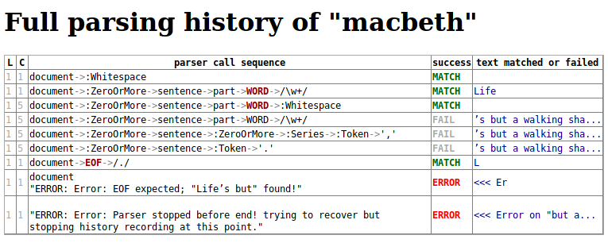

DHParser's Step by Step Guide
*****************************

This step by step guide goes through the whole process of desining and testing
a domain specific notation from the very start. (The terms "domain specific
notation" and "domain specific language" are used interchangeably in the
following. Both will abbreviated by "DSL", however.) We will design a simple
domain specific notation for poems as a teaching example. On the way we will
learn:

1. how to setup a new DHParser project

2. how to use the test driven development approach to designing a DSL

3. how to describe the syntax of a DSL with the EBNF-notation

4. how to specify the transformations for converting the concrete syntax tree
   that results from parsing a text denoted in our DLS into an abstract syntax
   tree that represents or comes close to representing out data model.

5. how to write a compiler that transforms the abstract syntax tree into a
   target representation which might be a html page, epub or printable pdf in
   the case of typical Digital-Humanities-projects.

Setting up a new DHParser project
=================================

Since DHParser, while quite mature in terms of implemented features, is still
in a pre-first-release state, it is for the time being more recommendable to
clone the most current version of DHParser from the git-repository rather than
installing the packages from the Python Package Index (PyPI).

This section takes you from cloning the DHParser git repository to setting up
a new DHParser-project in the ``experimental``-subdirectory and testing
whether the setup works. Similarly to current web development practices, most
of the work with DHParser is done from the shell. In the following, we assume
a Unix (Linux) environment. The same can most likely be done on other
operating systems in a very similar way, but there might be subtle
differences.

Installing DHParser from the git repository
-------------------------------------------

In order to install DHParser from the git repository, open up a shell window
and type::

    $ git clone https://gitlab.lrz.de/badw-it/DHParser.git
    $ cd DHParser

The second command changes to the DHParser directory. Within this directory
you should recognise the following subdirectories and files. There are more
files and directories for sure, but those will not concern us for now::

    DHParser/            - the DHParser python packages
    documentation/       - DHParser's documentation in html-form
    documentation_source - DHParser's documentation in reStructedText-Format
    examples/            - some exmamples for DHParser (mostly incomplete)
    experimental/        - an empty directory for experimenting
    test/                - DHParser's unit-tests
    dhparser.py          - DHParser's command line tool for setting up projects
    README.md            - General information about DHParser
    LICENSE.txt          - DHParser's license. It's open source (hooray!)
    Introduction.md      - An introduction and appetizer for DHParser

In order to verify that the installation works, you can simply run the
"dhparser.py" script and, when asked, chose "3" for the self-test. If the
self-test runs through without error, the installation has succeeded.

Staring a new DHParser project
------------------------------

In order to setup a new DHParser project, you run the ``dhparser.py``-script
with the name of the new project. For the sake of the example, let's type::

    $ python dhparser.py experimental/poetry
    $ cd experimental/poetry

This creates a new DHParser-project with the name "poetry" in directory with
the same name within the subdirectory "experimental". This new directory
contains the following files::

    README.md           - a stub for a readme-file explaiing the project
    poetry.ebnf         - a trivial demo grammar for the new project
    example.dsl         - an example file written in this grammar
    tst_poetry_grammar.py - a python script ("test-script") that re-compiles
                            the grammar (if necessary) and runs the unit tests
    grammar_tests/01_test_word.ini     - a demo unit test
    grammar_tests/02_test_document.ini - another unit test

Now, if you look into the file "example.dsl" you will find that it contains a
simple sequence of words, namely "Life is but a walking shadow". In fact, the
demo grammar that comes with a newly created project is nothing but simple
grammar for sequences of words separated by whitespace. Now, since we alread
have unit tests, our first exercise will be to run the unit tests by starting
the script "tst_poetry_grammar.py"::

    $ python tst_poetry_grammar.py

This will run through the unit-tests in the grammar_tests directory and print
their success or failure on the screen. If you check the contents of your
project directory after running the script, you might notice that there now
exists a new file "poetryCompiler.py" in the project directory. This is an
auto-generated compiler-script for our DSL. You can use this script to compile
any source file of your DSL, like "example.dsl". Let's try::

    $ python poetryCompiler.py example.dsl

The output is a block of pseudo-XML, looking like this::

    <document>
     <:ZeroOrMore>
       <WORD>
         <:RegExp>Life</:RegExp>
         <:Whitespace> </:Whitespace>
       </WORD>
       <WORD>
         <:RegExp>is</:RegExp>
         <:Whitespace> </:Whitespace>
       </WORD>
    ...

Now, this does not look too helpful yet, partly, because it is cluttered with
all sorts of seemingly superfluous pseudo-XML-tags like "<:ZeroOrMore>".
However, you might notice that it contains the original sequence of words
"Life is but a walking shadow" in a structured form, where each word is
(among other things) surrounded by <WORD>-tags. In fact, the output of the
compiler script is a pseudo-XML-representation of the *concrete syntax tree*
of our "example.dsl"-document according the grammar specified in "poetry.ebnf"
(which we haven't looked into yet, but we will do so soon).

If you see the pseudo-XML on screen, the setup of the new DHParser-project
has been successful.

Understanding how compilation of DSL-documents with DHParser works
------------------------------------------------------------------

Generally speaking, the compilation process consists of three stages:

1. Parsing a document. This yields a *concrete syntax tree* (CST) of the
   document.

2. Transforming. This transforms the CST into the much more concise *abstract
   syntax tree* (AST) of the document.

3. Compiling. This turns the AST into anything you'd like, for example, an
   XML-representation or a relational database record.

Now, DHParser can fully automatize the generation of a parser from a
syntax-description in EBNF-form, like our "poetry.ebnf", but it cannot
automatize the transformation from the concrete into the abstract syntax tree
(which for the sake of brevity we will simply call "AST-Transformation" in the
following), and neither can it automatize the compilation of the abstract syntax
tree into something more useful. Therefore, the AST-Transformation in the
autogenerated compile-script is simply left empty, while the compiling stage
simply converts the syntax tree into a pseudo-XML-format.

The latter two stages have to be coded into the compile-script by hand, with
the support of templates within this script. If the grammar of the DSL is
changed - as it will be frequently during the development of a DSL - the
parser-part of this script will be regenerated by the testing-script before
the unit tests are run. The script will notice if the grammar has changed.
This also means that the parser part of this script will be overwritten and
should never be edited by hand. The other two stages can and should be edited
by hand. Stubs for theses parts of the compile-script will only be generated
if the compile-script does not yet exist, that is, on the very first calling
of the test-script.

Usually, if you have adjusted the grammar, you will want to run the unit tests
anyway. Therefore, the regeneration of the parser-part of the compile-script
is triggered by the test-script.

The development workflow for DSLs
---------------------------------

When developing a domain specific notation it is recommendable to first
develop the grammar and the parser for that notation, then to the abstract
syntax tree transformations and finally to implement the compiler. Of course
one can always come back and change the grammar later. But in order to avoid
revising the AST-transformations and the compiler time and again it helps if
the grammar has been worked out before. A bit of interlocking between these
steps does not hurt, though.

A reasonable workflow for developing the grammar proceeds like this:

1. Set out by writing down a few example documents for your DSL. It is
   advisable to start with a few simple examples that use only a subset of the
   intended features of your DSL.

2. Next you sketch a grammar for your DSL that is just rich enough to capture
   those examples.

3. Right after sketching the grammar you should write test cases for your
   grammar. The test cases can be small parts or snippets of your example
   documents. You could also use your example documents as test cases, but
   usually the test cases should have a smaller granularity to make locating
   errors easier.

4. Next, you should run the test script. Usually, some test will fail at
   the first attempt. So you'll keep revising the EBNF-grammar, adjusting and
   adding test cases until all tests pass.

5. Now it is time to try and compile the example documents. By this time the
   test-script should have generated the compile-script, which you can be
   called with the example documents. Don't worry too much about the output,
   yet. What is important at this stage is merely whether the parser can
   handle the examples or not. If not, further test cases and adjustments the
   EBNF grammar will be needed - or revision of the examples in case you
   decide to use different syntactic constructs.

   If all examples can be parsed, you go back to step one and add further more
   complex examples, and continue to do so until you have the feeling that you
   DSL's grammar is rich enough for all intended application cases.

Let's try this with the trivial demo example that comes with creating a new
project with the "dhparser.py"-script. Now, you have already seen that the
"example.dsl"-document merely contains a simple sequence of words: "Life is
but a walking shadow" Now, wouldn't it be nice, if we could end this sequence
with a full stop to turn it into a proper sentence. So, open "examples.dsl"
with a text editor and add a full stop::

    Life is but a walking shadow.

Now, try to compile "examples.dsl" with the compile-script::

    $ python poetryCompiler.py example.dsl
    example.dsl:1:29: Error: EOF expected; ".\n " found!

Since the grammar, obviously, did not allow full stops so far, the parser
returns an error message. The error message is pretty self-explanatory in this
case. (Often, you will unfortunately find that the error message are somewhat
difficult to decipher. In particular, because it so happens that an error the
parser complains about is just the consequence of an error made at an earlier
location that the parser may not have been able to recognize as such. We will
learn more about how to avoid such situations, later.) EOF is actually the
name of a parser that captures the end of the file, thus "EOF"! But instead of
the expected end of file an, as of now, unparsable construct, namely a full
stop followed by a line feed, signified by "\n", was found.

Let's have look into the grammar description "poetry.ebnf". We ignore the
beginning of the file, in particular all lines starting with "@" as these
lines do not represent any grammar rules, but meta rules or so-called
"directives" that determine some general characteristics of the grammar, such
as whitespace-handling or whether the parser is going to be case-sensitive.
Now, there are exactly three rules that make up this grammar::

    document = ~ { WORD } §EOF
    WORD     =  /\w+/~
    EOF      =  !/./

EBNF-Grammars describe the structure of a domain specific notation in top-down
fashion. Thus, the first rule in the grammar describes the components out of
which a text or document in the domain specific notation is composed as a
whole. The following rules then break down the components into even smaller
components until, finally, there a only atomic components left which are
described be matching rules. Matching rules are rules that do not refer to
other rules any more. They consist of string literals or regular expressions
that "capture" the sequences of characters which form the atomic components of
our DSL. Rules in general always consist of a symbol on the left hand side of
a "="-sign (which in this context can be understood as a definition signifier)
and the definition of the rule on the right hand side.

.. note:: Traditional parser technology for context-free grammars often
    distinguishes two phases, *scanning* and *parsing*, where a lexical scanner
    would take a stream of characters and yield a sequence of tokens and the
    actual parser would then operate on the stream of tokens. DHParser,
    however, is an instance of a *scannerless parser* where the functionality
    of the lexical scanner is seamlessly integrated into the
    parser. This is done by allowing regular expressions in the definiendum of
    grammar symbols. The regular expressions do the work of the lexical
    scanner.

    Theoretically, one could do without scanners or regular expressions.
    Because regular languages are a subset of context-free languages, parsers
    for context-free languages can do all the work that regular expressions can
    do. But it makes things easier - and, in the case of DHParser, also faster
    - to have them.

In our case the text as a whole, conveniently named "document" (any other name
would be allowed, too), consists of a leading whitespace, a possibly empty
sequence of an arbitrary number of words words ending only if the end of file
has been reached. Whitespace in DHParser-grammars is always denoted by a tilde
"~". Thus, the definiens of the rule "document" starts with a "~" on the right
hand side of the definition sign ("="). Next, you find the symbol "WORD"
enclosed in braces. "WORD", like any symbol composed of letters in DHParser,
refers to another rule further below that defines what words are. The meaning
of the braces is that whatever is enclosed by braces may be repeated zero or
more times. Thus the expression "{ WORD }" describes a sequence of arbitrarily
many repetitions of WORD, whatever WORD may be. Finally, EOF refers to yet
another rule defined further below. We do not yet know what EOF is, but we
know that when the sequence of words ends, it must be followed by an EOF. The
paragraph sign "§" in front of EOF means that it is absolutely mandatory that
the sequence of WORDs is followed by an EOF. If it doesn't the program issues
an error message. Without the "§"-sign the parser simply would not match,
which in itself is not considered an error.

Now, let's look at our two matching rules. Both of these rules contain regular
expressions. If you do not know about regular expressions yet, you should head
over to an explanation or tutorial on regular expressions, like
https://docs.python.org/3/library/re.html, before continuing, because we are
not going to discuss them here. In DHParser-Grammars regular expressions are
enclosed by simple forward slashes "/". Everything between two forward slashes
is a regular expression as it would be understood by Python's "re"-module.
Thus the rule ``WORD = /\w+/~`` means that a word consists of a sequence of
letters, numbers or underscores '_' that must be at least one sign long. This
is what the regular expression "\w+" inside the slashes means. In regular
expressions, "\w" stands for word-characters and "+" means that the previous
character can be repeated one or more times. The tile "~" following the
regular expression, we already know. It means that a a word can be followed by
whitespace. Strictly speaking that whitespace is part of "WORD" as it is
defined here.

Similarly, the EOF (for "end of line") symbol is defined by a rule that
consists of a simple regular expression, namely ".". The dot in regular
expressions means any character. However, the regular expression itself
preceded by an exclamations mark "!". IN DHParser-Grammars, the explanation
mark means "not". Therefore the whole rule means, that *no* character must
follow. Since this is true only for the end of file, the parser looking for
EOF will only match if the very end of the file has been reached.

Now, what would be the easiest way to allow our sequence of words to be ended
like a real sentence with a dot "."?  As always when defining grammars on can
think of different choice to implement this requirement in our grammar. One
possible solution is to add a dot-literal before the "§EOF"-component at the
end of the definition of the "document"-rule. So let's do that. Change the
line where the "document"-rule is defined to::

    document = ~ { WORD } "." §EOF

As you can see, string-literals are simply denoted as strings between inverted
commas in DHParser's variant of the EBNF-Grammar. Now, before we can compile
the file "example.dsl", we will have to regenerate the our parser, because we
have changed the grammar. In order to recompile, we simply run the test-script
again::

    $ python tst_poetry_grammar.py

But what is that? A whole lot of error messages? Well, this it not surprising,
because we change the grammar, some of our old test-cases fail with the new
grammar. So we will have to update our test-cases. Actually, the grammar
gets compiled never the less and we could just ignore the test failures and
carry on with compiling our "example.dsl"-file again. But, for this time,
we'll follow good practice and adjust the test cases. So open the test that
failed, "grammar_tests/02_test_document.ini", in the editor and add full stops
at the end of the "match"-cases and remove the full stop at the end of the
"fail"-case::

    [match:document]
    M1: """This is a sequence of words
       extending over several lines."""
    M2: """  This sequence contains leading whitespace."""

    [fail:document]
    F1: """This test should fail, because neither
       comma nor full have been defined anywhere"""

The format of the test-files should be pretty self-explanatory. It is a simple
ini-file, where the section markers hold the name of the grammar-rule to be
tested which is either preceded by "match" or "fail". "match means" that the
following examples should be matched by the grammar-rule. "fail" means they
should *not* match. It is just as important that a parser or grammar-rules
does not match those strings it should not match as it is that it matches
those strings that it should match. The individual test-cases all get a name,
in this case M1, M2, F1, but if you prefer more meaningful names this is also
possible. (Beware, however, that the names for the match-tests must be different from the
names for the fail-tests for the same rule!). Now, run the test-script again
and you'll see that no errors get reported any more.

Finally, we can recompile out "example.dsl"-file, and by its XML output we can
tell that it worked::

    $ python poetryCompiler.py example.dsl

So far, we have seen *in nuce* how the development workflow for a building up
DSL-grammar goes. Let's take this a step further by adding more capabilities
to our grammar.

Extending the example DSL further
---------------------------------

A grammar that can only digest single sentences is certainly a rather boring.
So we'll extend our grammar a little further so that it can capture paragraphs
of sentences. To see, where we are heading, let's first start a new example
file, let's call it "macbeth.dsl" and enter the following lines::

    Life’s but a walking shadow, a poor player that struts and frets his hour
    upon the stage and then is heard no more. It is a tale told by an idiot,
    full of sound and fury, signifying nothing.

What have we got, there? We've got a paragraph that consists of several
sentences each of which ends with a full stop. The sentences themselves can
consist of different parts which a separated by a comma. If, so far, we have
got a clear idea (in verbal terms) of the structure of texts in our DSL, we
can now try to formulate this in the grammar.::

    document = ~ { sentence } §EOF
    sentence = part {"," part } "."
    part     = { WORD }              # a subtle mistake, right here!
    WORD     =  /\w+/~               # something forgotten, here!
    EOF      =  !/./

The most important new part is the grammar rule "sentence". It reads as this:
A sentence is a part of a sentence potentially followed by a repeated sequence
of a comma and another part of a sentence and ultimately ending with a full
stop. (Understandable? If you have ever read Russell's "Introduction to
Mathematical Philosophy" you will be used to this kind of prose. Other than
that I find the formal definition easier to understand. However, for learning
EBNF or any other formalism, it helps in the beginning to translate the
meaning of its statements into plain old English.)

There is are two subtle mistakes in this grammar. If you can figure them out
just by thinking about it, feel free to correct the grammar right now. (Would
you really have noticed the mistakes if they hadn't already been marked in the
code above?) For all less intelligent people, like me: Let's be prudent and -
since the grammar has become more complex - add a few test cases. This should
make it easier to locate any errors. So open up an editor with a new file in
the tests subdirectory, say ``grammar_tests/03_test_sentence.ini`` (Test files
should always contain the component `test_` in the filename, otherwise they
will be overlooked by DHParser's unit testing subsystem) and enter a few
test-cases like these::

    [match:sentence]
    M1: """It is a tale told by an idiot,
      full of sound and fury, signifying nothing."""
    M2: """Plain old sentence."""

    [fail:sentence]
    F1: """Ups, a full stop is missing"""
    F2: """No commas at the end,."""

Again, we recompile the grammar and run the test at the same time by running
the testing-script::

    $ python tst_poetry_grammar.py
    Errors found by unit test "03_test_sentence.ini":
    Fail test "F2" for parser "sentence" yields match instead of expected failure!

Too bad, something went wrong here. But what? Didn't the definition of the
rule "sentence" make sure that parts of sentences are, if at all, only be
followed by a sequence of a comma *and* another part of a sentence. So, how
come that between the last comma and the full stop there is nothing but empty
space? Ah, there's the rub! If we look into our grammar, how parts of
sentences have been defined, we find that the rule::

    part = { WORD }

defines a part of a sentence as a sequence of *zero* or more WORDs. This
means that a string of length zero also counts as a valid part of a sentence.
Now in order to avoid this, we could write::

    part = WORD { WORD }

This definition makes sure that there is at least on WORD in a part. Since the
case that at least one item is needed occurs rather frequently in grammars,
DHParser offers a special syntax for this case::

    part = { WORD }+

(The plus sign "+" must always follow directly after the curly brace "}"
without any whitespace in between, otherwise DHParser won't understannd it.)
At this point the worry may arise that the same problem could reoccur at
another level, if the rule for WORD would match empty strings as well. Let's
quickly add a test case for this to the file
``grammar_tests/01_test_word.ini``::

    [fail:WORD]
    F1: two words
    F2: ""

Thus, we are sure to be warned in case the definition of rule "WORD" matches
the empty string. Luckily, it does not do so now. But it might happen that we
change this definition later again for some reason, we might have forgotten
about this subtlety and introduce the same error again. With a test case we
can reduce the risk of such a regression error. This time the tests run
through, nicely. So let's try the parser on our new example::

    $ python poetryCompiler.py macbeth.dsl
    macbeth.dsl:1:1: Error: EOF expected; "Life’s but" found!

That is strange. Obviously, there is an error right at the beginning (line 1
column 1). But what could possibly be wrong with the word "Life". Now you might
already have guessed what the error is and that the error is not exactly
located in the first column of the first line.

Unfortunately, DHParser - like almost any other parser out there - is not
always very good at spotting the exact location of an error. Because rules
refer to other rules, a rule may fail to parse - or, what is just as bad,
succeed to parse when it should indeed fail - as a consequence of an error in
the definition of one of the rules it refers to. But this means if the rule
for the whole document fails to match, the actual error can be located
anywhere in the document! There a different approaches to dealing with this
problem. A tool that DHParser offers is to write log-files that document the
parsing history. The log-files allow to spot the location, where the parsing
error occurred. However, you will have to look for the error manually. A good
starting point is usually either the end of the parsing process or the point
where the parser reached the farthest into the text. In order to receive the
parsing history, you need to run the compiler-script again with the debugging
option::

    $ python poetryCompiler.py macbeth.dsl

You will receive the same error messages as before. but this time various
kinds of debugging information have been written into a new created
subdirectory "LOGS". (Beware that any files in the "LOGS" directory may be
overwritten or deleted by any of the DHParser scripts upon the next run! So
don't store any important data there.) The most interesting file in the
"LGOS"-directory is the full parser log. We'll ignore the other files and just
open the file "macbeth_full_parser.log.html" in an internet-browser. As the
parsing history tends to become quite long, this usually takes a while, but
luckily not in the case of our short demo example::

    $ firefox LOGS/macbeth_full_parser.log.html &

What you see is a representation of the parsing history. It might look a bit
tedious in the beginning, especially the column that contains the parser
call sequence. But it is all very straight forward: For every application of a
match rule, there is a row in the table. Typically, match rules are applied at
the end of a long sequence of parser calls that is displayed in the third
column. You will recognise the parsers that represent rules by their names,
e.g. "document", "sentence" etc. Those parsers that merely represent
constructs of the EBNF grammar within a rule do not have a name and are
represented by this type, which always begins with a colon, like
":ZeroOrMore". Finally, the regular expression or literal parsers are
represented by the regular expression pattern or the string literal
themselves. (Arguably, it can be confusing that parsers are represented in
three different ways in the parer call sequence. I am still figuring out a
better way to display the parser call sequence. Any suggestions welcome!) The
first two columns display the position in the text in terms of lines and
columns. The second but last column, labeled "success" shows wether the last
parser in the sequence matched or failed or produced an error. In case of an
error, the error message is displayed in the third column as well. In case the
parser matched, the last column displays exactly that section of the text that
the parser did match. If the parser did not match, the last column displays
the text that still lies ahead and has not yet been parsed.

In our concrete example, we can see that the parser "WORD" matches "Life", but
not "Life’s" or "’s". And this ultimately leads to the failure of the parsing
process as a whole. The most simple solution would be to add the apostrophe to
the list of allowed characters in a word by changing the respective line in
the grammar definition to ``WORD = /[\w’]+/``. Now, before we even change the
grammar we first add another test case to capture this kind of error. Since we
have decided that "Life’s" should be parsed as a singe word, let's open the
file "grammar_tests/01_test_word.ini" and add the following test::

    [match:WORD]
    M3: Life’s

To be sure that the new test captures the error we have found you might want
to run the script "tst_poetry_grammar.py" and verify that it reports the
failure of test "M3" in the suite "01_test_word.ini". After that, change the
regular expression for the symbol WORD in the grammar file "poetry.ebnf" as
just described. Now both the tests and the compilation of the file
"macbeth.dsl" should run through smoothly.

.. caution:: Depending on the purpose of your DSL, the simple solution of
   allowing apostrophes within words, might not be what you want. After all
   "Life’s" is but a shorthand for the two word phrase "Life is". Now,
   whatever alternative solution now comes to your mind, be aware that there
   are also cases like Irish names, say "O’Dolan" where the apostrophe is
   actually a part of a word and cases like "don’t" which, if expanded, would
   be two words *not* separated at the position of the apostrophe.

   We leave that as an exercise, first to figure out, what different cases for
   the use of apostrophes in the middle of a word exist. Secondly, to make a
   reasonable decision which of these should be treated as a single and which
   as separate words and, finally, if possible, to write a grammar that
   provides for these cases. These steps are quite typical for the kind of
   challenges that occur during the design of a DSL for a
   Digital-Humanities-Project.

Controlling abstract-syntax-tree generation
-------------------------------------------

Compiling the example "macbeth.dsl" with the command ``python poetryCompier.py
macbeth.dsl``, you might find yourself not being able to avoid the impression
that the output is rather verbose. Just looking at the beginning of the
output, we find::

    <document>
       <:ZeroOrMore>
           <sentence>
               <part>
                   <WORD>
                       <:RegExp>Life’s</:RegExp>
                       <:Whitespace> </:Whitespace>
                   </WORD>
                   <WORD>
                       <:RegExp>but</:RegExp>
                       <:Whitespace> </:Whitespace>
                   </WORD>
    ...

But why do we need to know all those details! Why would we need a
":ZeroOrMore" element inside the "<document>" element, if the
"<sentence>"-elements could just as well be direct descendants of the
"<document>"-element? Why do we need the information that "Life’s" has been
captured by a regular expression parser? Wouldn't it suffice to know that the
word captured is "Life’s"? And is the whitespace really needed at all? If the
words in a sequence are separated by definition by whitespace, then it would
suffice to have the word without whitespace in our tree, and to add whitespace
only later when transforming the tree into some kind of output format. (On the
other hand, it might be convenient to have it in the tree never the less...)

Well, the answer to most of these questions is that what our compilation
script yields is more or less the output that the parser yields which in turn
is the *concrete syntax tree* of the parsed text. Being a concrete syntax tree
it is by its very nature very verbose, because it captures every minute
syntactic detail described in the grammar and found in the text, no matter how
irrelevant it is, if we are primarily interested in the structure of our text.
In order for our tree to become more handy we have to transform it into an
*abstract syntax tree* first, which is called thus because it abstracts from
all details that deem us irrelevant. Now, which details we consider as
irrelevant is almost entirely up to ourselves. And we should think carefully
about what features must be included in the abstract syntax tree, because the
abstract syntax tree more or less reflects the data model (or is at most one
step away from it) with which we want to capture our material.

For the sake of our example, let's assume that we are not interested in
whitespace and that we want to get rid of all uninformative nodes, i.e. nodes
that merely demark syntactic structures but not semantic entities.

DHParser supports the transformation of the concrete syntax tree (CST) into the
abstract syntax tree (AST) with a simple technology that (in theory) allows to
specify the necessary transformations in an almost declarative fashion: You
simply fill in a Python-dictionary of tag-names with transformation *operators*.
Technically, these operators are simply Python-functions. DHParser comes with a
rich set of predefined operators. Should these not suffice, you
can easily write your own. How does this look like? ::

    poetry_AST_transformation_table = {
       "+": remove_empty,
       "document": [],
       "sentence": [],
       "part": [],
       "WORD": [],
       "EOF": [],
       ":Token, :RE": reduce_single_child,
       "*": replace_by_single_child
    }

You'll find this table in the script ``poetryCompiler.py``, which is also the
place where you edit the table, because then it is automatically used when
compiling your DSL-sources. Now, AST-Transformation works as follows: The whole
tree is scanned, starting at the deepest level and applying the specified
operators and then working its way upward. This means that the operators
specified for "WORD"-nodes will be applied before the operators of "part"-nodes
and "sentence"-nodes. This has the advantage that when a particular node is
reached the transformations for its descendant nodes have already been applied.

As you can see, the transformation-table contains an entry for every known
parser, i.e. "document", "sentence", "part", "WORD", "EOF". (If any of these are
missing in the table of your ``poetryCompiler.py``, add them now!) In the
template you'll also find transformations for two anonymous parsers, i.e.
":Token" and ":RE" as well as some curious entries such as "*" and "+". The
latter are considered to be "jokers". The transformations related to the
"+"-sign will be applied on any node, before any other transformation is
applied. In this case, all empty nodes will be removed first (transformation:
``remove_empty``). The "*"-joker contains a list of transformations that will be
applied to all those tags that have not been entered explicitly into the
transformation table. For example, if the transformation reaches a node with the
tag-name ":ZeroOrMore" (i.e. an anonymous node that has been generated by the
parser ":ZeroOrmore"), the "*"-joker-operators will be applied. In this
case it is just one transformation, namely, ``replace_by_single_child`` which
replaces a node that has but one child by its child. In contrast, the
transformation ``reduce_single_child`` eliminates a single child node by
attaching the child's children or content directly to the parent node. We'll see
what this means and how this works, briefly.

.. caution:: Once the compiler-script "xxxxCompiler.py" has been generated, the
    *only* part that is changed after editing and extending the grammar is the
    parser-part of this script (i.e. the class derived from class Grammar),
    because this part is completely auto-generated and can therefore be
    overwritten safely. The other parts of that script, including the
    AST-transformation-dictionary, if never changed once it has been generated,
    because it needs to be filled in by hand by the designer of the DSL and the
    hand-made changes should not be overwritten. There it is left as it is when
    regenerating the parser. However, this means, if you add symbols to your
    grammar later, you will not find them as keys in the
    AST-transformation-table, but you'll have to add them yourself.

    The comments in the compiler-script clearly indicate which parts can be
    edited by hand safely, i.e. without running the risk of being overwritten, an
    which cannot.

We can either specify no operator (empty list), a single operator or a list of
operators for transforming a node. There is a difference between specifying an
empty list for a particular tag-name or leaving out a tag-name completely. In the
latter case the "*"-joker is applied, in place of the missing list of operators.
In the former case only the "+"-joker is applied. If a list of operators is
specified, these operator will be applied in sequence one after the other. We
also call the list of operators or the single operator if there is only one the
*transformation* for a particular tag (or parser name or parser type for that
matter).

Because the AST-transformation works through the table from the inside to the
outside, it is reasonable to do the same when designing the AST-transformations,
to proceed in the same order. The innermost nodes that concern us are the nodes
captured by the <WORD>-parser, or simply, <WORD>-nodes. As we can see, these
nodes usually contain a <:RegExp>-node and a <:Whitespace>-node. As the "WORD"
parser is defined as a simple regular expression with followed by optional
whitespace in our grammar, we now that this must always be the case, although
the whitespace may occasionally be empty. Thus, we can eliminate the
uninformative child nodes by removing whitespace first and the reducing the
single left over child node. The respective line in the AST-transformation-table
in the compiler-script should be changed as follows::

    "WORD": [remove_whitespace, reduce_single_child],

Running the "poetryCompiler.py"-script on "macbeth.dsl" again, yields::

    <document>
     <:ZeroOrMore>
       <sentence>
         <part>
           <WORD>Life’s</WORD>
           <WORD>but</WORD>
           <WORD>a</WORD>
           <WORD>walking</WORD>
           <WORD>shadow</WORD>
         </part>
         <:Series>
           <:Token>
             <:PlainText>,</:PlainText>
             <:Whitespace> </:Whitespace>
           </:Token>
           <part>
             <WORD>a</WORD>
    ...

It starts to become more readable and concise, but there are sill some oddities.
Firstly, the Tokens that deliminate parts of sentences still contain whitespace.
Secondly, if several <part>-nodes follow each other in a <sentence>-node, the
<part>-nodes after the first one are enclosed by a <:Series>-node or even a
cascade of <:ZeroOrMore> and <:Series>-nodes. As for the <:Token>-nodes, have
can do the same trick as with the WORD-nodes::

    ":Token": [remove_whitespace, reduce_single_child],
    ":RE": reduce_single_child,

As to the nested structure of the <part>-nodes within the <sentence>-node, this
a rather typical case of syntactic artefacts that can be found in concrete
syntax trees. It is obviously a consequence of the grammar definition::

    sentence = part {"," part } "."

We'd of course prefer to have flat structure of parts and punctuation marks
following each other within the sentence. Since this is a standard case,
DHParser includes a special operator to "flatten" nested structures of this
kind::

    "sentence" = [flatten],

The ``flatten`` operator recursively eliminates all intermediary anonymous child
nodes. We do not need to do anything in particular for transforming the
<part>-node, except that we should explicitly assign an empty operator-list to
it, because we do not want the "*" to step in. The reason is that a <part> with
a single <WORD> should still be visible as a part a not replaced by the
<WORD>-node, because we would like our data model to have has regular a form as
possible. (This does of course imply a decision that we have taken on the form
of our data model, which would lead too far to discuss here. Suffice it to say
that depending on the occasion and purpose, such decisions can also be taken
otherwise.)

The only kind of nodes left are the <document>-nodes. In the output of the
compiler-script (see above), the <document>-node had a single child-node
":ZeroOrMore". Since this child node does not have any particular semantic
meaning it would reasonable to eliminate it and attach its children directly to
"document". We could do so by entering ``reduce_single_child`` in the lost of
transformations for "document"-nodes. However, when designing the
AST-transformations, it is important not only to consider the concrete output
that a particular text yields, but all possible outputs. Therefore, before
specifying a transformation, we should also take a careful look at the grammar
again, where "document" is defined as follows::

    document = ~ { sentence } §EOF

As we can see a "document"-node may also contain whitespace and an EOF-marker.
The reason why we don't find these in the output is that empty nodes have been
eliminated by the ``remove_empty``-transformation specified in the "+"-joker,
before. While EOF is always empty (little exercise: explain why!). But there
could be ":Whitespace"-nodes next to the zero or more sentences in the document
node, in which case the "reduce_single_child"-operator would do nothing, because
there is more than a single child. (We could of course also use the
"flatten"-operator, instead. Try this as an exercise.) Test cases help to
capture those different scenarios, so adding test cases and examining the output
in the test report help to get a grip on this, if just looking at the grammar
strains you imagination too much.

Since we have decided, that we do not want to include whitespace in our data
model, we can simply eliminate any whitespace before we apply the
``reduce_single_child``-operator, so we change the "document"-entry in the
AST-transformation-table as thus::

    "document": [remove_whitespace, reduce_single_child],

Now that everything is set, let's have a look at the result::

    <document>
     <sentence>
       <part>
         <WORD>Life’s</WORD>
         <WORD>but</WORD>
         <WORD>a</WORD>
         <WORD>walking</WORD>
         <WORD>shadow</WORD>
       </part>
       <:Token>,</:Token>
       <part>
         <WORD>a</WORD>
         <WORD>poor</WORD>
         <WORD>player</WORD>
    ...

That is much better. There is but one slight blemish in the output: While all
nodes left a named nodes, i.e. nodes associated with a named parser, there are a
few anonymous <:Token> nodes. Here is a little exercise: Do away with those
<:Token>-nodes by replacing them by something semantically more meaningful.
Hint: Add a new symbol "delimiter" in the grammar definition "poetry.ebnf". An
alternative strategy to extending the grammar would be to use the
``replace_parser`` operator. Which of the strategy is the better one? Explain
why.
