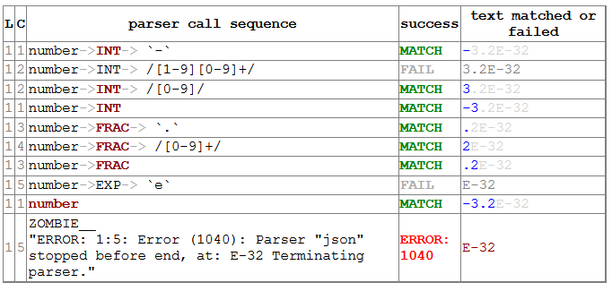

Overview of DHParser
====================

DHParser is a parser-generator and domain-specific-language (DSL) construction
kit that is designed to make the process of designing, implementing and revising
a DSL as simple as possible. It can be used in an adhoc-fashion for small
projects and the grammar can either be specified in Python (similar to the
approach of `pyparsing <https://pypi.org/project/pyparsing/>`_) or,
alternatively, in a slightly amended version of the `Extended-Backus-Naur-Form
(EBNF) <https://en.wikipedia.org/wiki/Extended_Backus%E2%80%93Naur_form>`_
directly within the Python-code. But DHParser can just as well be used for large
projects where you set up a directory tree with the grammar, parser, test-runner
each residing in a separate file und the test and example code in dedicated
sub-directories.

DHParser uses `packrat parsing <https://bford.info/packrat/>`_ with full
left-recursion support which allows to build parsers for about any context-free
grammar. Thus, when writing a grammar you do not need to worry about potential
restrictions of the parser. DHParser provides a post-mortem debugger to analyse
the parsing process and it offers facilities for unit-testing grammars as well
as some (experimental) support for fail-tolerant parsing so that the parser does
not stop at the first syntax error it encounters. Finally, it provides the 
necessary boilerplate code for language servers that adhere to the
editor-independent the `language server-protocol
<https://microsoft.github.io/language-server-protocol/>`_. This makes adding
editor support for you own DSL easy - no matter which editor is your (or your
user's) favorite one.


Generating a parser from a Grammar
----------------------------------

Generating a parser does not requires more than writing your grammar in EBNF
and compiling it with the "dhparser"-command into a readily usable Python-script!

Let's try this with a parser for the Javascript-Object-Notation (JSON). To
generate a json-Parser, just store the following EBNF-code which closely resembles
the grammar on the `JSON-Website <https://www.json.org/>`_ in a file named
"json.ebnf"::

        @literalws  = right
        @drop       = whitespace, strings
        @disposable = /_\w+/

        json        = ~ _element _EOF
        _element    = object | array | string | number | _bool | null
        object      = "{" member { "," §member } §"}"
        member      = string §":" _element
        array       = "[" [ _element { "," _element } ] §"]"
        string      = `"` §_CHARACTERS `"` ~
        number      = INT [ FRAC ] [ EXP ] ~
        _bool       = true | false
        true        = `true` ~
        false       = `false` ~
        null        = "null"

        _CHARACTERS = { PLAIN | ESCAPE }
        PLAIN       = /[^"\\]+/
        ESCAPE      = /\\[\/bnrt\\]/ | UNICODE
        UNICODE     = "\u" HEX HEX
        HEX         = /[0-9a-fA-F][0-9a-fA-F]/

        INT         = [`-`] ( /[1-9][0-9]+/ | /[0-9]/ )
        FRAC        = `.` /[0-9]+/
        EXP         = (`E`|`e`) [`+`|`-`] /[0-9]+/

        _EOF        =  !/./

(The three lines starting with an ``@``-sign at the beginning of the
grammar-string are not standard EBNF-code,  but DHParser-directives (see :py:mod:`ebnf`)
which help to streamline the syntax-tree that the parser produces.)

Then, run the "dhparser"-script to generate a parser::

    $ dhparser json.ebnf

This generates a script ``jsonParser.py`` that can be called with any
text-file or string to produce a syntax-tree::

    $ echo '{ "one": 1, "two": 2 }' >test.json
    $ python jsonParser.py --xml test.json
    <json>
      <object>
        <member>
          <string>
            <ANONYMOUS_Text__>"</ANONYMOUS_Text__>
            <PLAIN>one</PLAIN>
            <ANONYMOUS_Text__>"</ANONYMOUS_Text__>
          </string>
          <number>
            <INT>1</INT>
          </number>
        </member>
        <member>
          <string>
            <ANONYMOUS_Text__>"</ANONYMOUS_Text__>
            <PLAIN>two</PLAIN>
            <ANONYMOUS_Text__>"</ANONYMOUS_Text__>
          </string>
          <number>
            <INT>2</INT>
          </number>
        </member>
      </object>
    </json>


Mind that the generated script does not yield the json data in form of a
nested tree of python dictionaries and arrays but only the syntax tree
of the JSON-document. To derive the actual JSON-data from the syntax-tree
of a JSON-document a few more processing steps are necessary (see further below). 


Creating parsers within a Python-script
---------------------------------------

In case you just need a parser for some very simple DSL, you can directly add a string
with the EBNF-grammar of that DSL to you python code and compile if into an executable
parser much like you'd compile a regular expresseion. Let's do this for a
`JSON <https://www.json.org/>`_-parser::

    import sys
    from DHParser.dsl import create_parser

    json_grammar = r"""
        @literalws  = right
        @drop       = whitespace, strings
        @disposable = /_\w+/

        json        = ~ _element _EOF
        _element    = object | array | string | number | _bool | null
        object      = "{" member { "," §member } §"}"
        member      = string §":" _element
        array       = "[" [ _element { "," _element } ] §"]"
        string      = `"` §_CHARACTERS `"` ~
        number      = INT [ FRAC ] [ EXP ] ~
        _bool       = true | false
        true        = `true` ~
        false       = `false` ~
        null        = "null"

        _CHARACTERS = { PLAIN | ESCAPE }
        PLAIN       = /[^"\\]+/
        ESCAPE      = /\\[\/bnrt\\]/ | UNICODE
        UNICODE     = "\u" HEX HEX
        HEX         = /[0-9a-fA-F][0-9a-fA-F]/

        INT         = [`-`] ( /[1-9][0-9]+/ | /[0-9]/ )
        FRAC        = `.` /[0-9]+/
        EXP         = (`E`|`e`) [`+`|`-`] /[0-9]+/

        _EOF        =  !/./
        """

    json_parser = create_parser(json_grammar, 'JSON')

    if __name__ == '__main__':
        if len(sys.argv) > 1:
            with open(sys.argv[1], 'r', encoding='utf-8') as f:
                json_text = f.read()
        else:
            # just a test
            json_text = '{ "one": 1, "two": 2 }'
        syntax_tree = json_parser(json_text)
        print(syntax_tree.serialize(how='XML'))


Instead of specifying the grammar with EBNF and then generating a parser
form the grammar, parsers can also be directly written with Python-code::

    import sys, re

    from DHParser.parse import Grammar, Forward, Whitespace, Drop, NegativeLookahead, \
        ZeroOrMore, RegExp, Option, TKN, DTKN, Text

    _element = Forward().name('_element', disposable=True)
    _dwsp = Drop(Whitespace(r'\s*'))
    _EOF = NegativeLookahead(RegExp('.'))
    EXP = (Text("E") | Text("e") + Option(Text("+") | Text("-")) + RegExp(r'[0-9]+')).name('EXP')
    FRAC = (Text(".") + RegExp(r'[0-9]+')).name('FRAC')
    INT = (Option(Text("-")) + RegExp(r'[1-9][0-9]+') | RegExp(r'[0-9]')).name('INT')
    HEX = RegExp(r'[0-9a-fA-F][0-9a-fA-F]').name('HEX')
    UNICODE = (DTKN("\\u") + HEX + HEX).name('unicode')
    ESCAPE = (RegExp('\\\\[/bnrt\\\\]') | UNICODE).name('ESCAPE')
    PLAIN = RegExp('[^"\\\\]+').name('PLAIN')
    _CHARACTERS = ZeroOrMore(PLAIN | ESCAPE)
    null = TKN("null").name('null')
    false = TKN("false").name('false')
    true = TKN("true").name('true')
    _bool = true | false
    number = (INT + Option(FRAC) + Option(EXP) + _dwsp).name('number')
    string = (Text('"') + _CHARACTERS + Text('"') + _dwsp).name('string')
    array = (DTKN("[") + Option(_element + ZeroOrMore(DTKN(",") + _element)) + DTKN("]")).name('array')
    member = (string + DTKN(":") + _element).name('member')
    json_object = (DTKN("{") + member +  ZeroOrMore(DTKN(",") + member) + DTKN("}")).name('json_object')
    _element.set(json_object | array | string | number | _bool | null)
    json = (_dwsp + _element + _EOF).name('json')

    json_parser = Grammar(json)

    if __name__ == '__main__':
        if len(sys.argv) > 1:
            with open(sys.argv[1], 'r', encoding='utf-8') as f:
                json_text = f.read()
        else:
            # just a test
            json_text = '{ "one": 1, "two": 2 }'
        syntax_tree = json_parser(json_text)
        print(syntax_tree.serialize(how='indented'))

There are few caveats when defining parsers directly within Python-code:
Any parser that is referred to in other parsers must be assigned to a variable. Unless they are
disposable (see :py:ref`~ebnf.simlpifying_syntax_trees`), their name must be assigned
explicitly with the :py:meth:`~parse.Parser.name`-method. Forward-declarations always need to be
named explicitly, even if the declared parser is considered disposable.

Both of this can be avoided be encapsulating the variables defining the parser in 
a class definition. Doing so has the further benefit to reduce namespace-pollution::

    class JSON:
        _element = Forward().name('_element', disposable=True)
        ...
        json = (_dwsp + _element + _EOF).name('json')

    json_parser = Grammar(JSON.json)
    ...

Usually, the best alternative is to specify the grammar in EBNF, compile it and then copy and paste the
compiled grammar into your script. This is easier and neater than specifying the parser with Python-code, but 
it also saves the added startup time that results from compiling the gramar within the Python-script. 


.. _full_scale_DSLs:

Full scale DSLs
---------------

Larger and more complex DSL-projects can easily be set up by calling the
"dhparser"-script with a name of a project-directory that will then be created
and filled with templates for the project-files::

   $ dhparser JSON
   $ cd JSON
   $ dir
   example.dsl  JSON.ebnf    JSONServer.py  README.md  tests_grammar  tst_JSON_grammar.py

The first step is to replace the ".ebnf"-file that contains a simple demo-grammar with your
own grammar. For the sake of the example we'll write our json-Grammar into this file::

    #  EBNF-Directives

    @literalws  = right  # eat insignificant whitespace to the right of literals
    @whitespace = /\s*/  # regular expression for insignificant whitespace
    @comment    = /(?:\/\/.*)|(?:\/\*(?:.|\n)*?\*\/)/  # C++ style comments
    @drop       = whitespace, strings  # silently drop bare strings and whitespace
    @disposable = /_\w+/  # regular expression to identify disposable symbols

    #:  compound elements

    json        = ~ _element _EOF
    _element    = object | array | string | number | _bool | null
    object      = "{" member { "," §member } §"}"
    member      = string §":" _element
    array       = "[" [ _element { "," _element } ] §"]"

    #:  simple elements

    string      = `"` §_CHARACTERS `"` ~
    number      = INT [ FRAC ] [ EXP ] ~
    _bool       = true | false
    true        = `true` ~
    false       = `false` ~
    null        = "null"

    #:  atomic expressions types

    # string components
    _CHARACTERS = { PLAIN | ESCAPE | UNICODE }
    PLAIN       = /[^"\\]+/
    ESCAPE      = /\\[\/bnrt\\"]/
    UNICODE     = "\u" HEX HEX
    HEX         = /[0-9a-fA-F][0-9a-fA-F]/

    # number components
    INT         = [`-`] ( /[1-9][0-9]+/ | /[0-9]/ )
    FRAC        = `.` /[0-9]+/
    EXP         = (`E`|`e`) [`+`|`-`] /[0-9]+/

    _EOF        =  !/./

The division of the grammar into several sections is purely conventional. If a
comment-line starts with ``#:`` this is a hint to the test script to generate a
separate unit-test-template with the section-name that follows in the same line.

The "tst_XXX_grammar.py"-script is the most important tool in any DSL-project.
The script generates or updates the "XXXParser.py"-program if the grammar has
changed and runs the unit tests in the "tests_grammar" subdirectory. After
filling in the above grammar in the "json.ebnf"-file, a parser can be generated
by running the test script::

    $ python tst_JSON_grammar.py

If there were no errors, a new "jsonParser.py"-file appears in the directory.
Before we can try it, we need some test-data. Then we can run the script just
like before::

    $ rm example.dsl
    $ echo '{ "one": 1, "two": 2 }' >example.json
    $ python JSONParser.py --xml example.json
    <json>
      <object>
      ...

Clutter-free grammars
---------------------

DHParser tries to minimize unnecessary clutter in grammar definitions.
To reach this goal DHParser follows a few, mostly intuitive, conventions:

1. The symbols on the left hand side of any definition (or "rule" or "production")
   are considered significant by default.

   Nodes generated by a parser associated to a symbol will carry the symbol's
   name and are considered strcuturally relevant, i.e. they will be eliminated
   silently. All other nodes are considered as structurally irrellevant and may
   silently be removed from the syntax-tree to simplify its structure while
   preserving its content.

2. Symbols can, however, be marked as "disposable", too.

   Thus, you'll never see an "_elment"-node in a JSON-syntax-tree produced
   by the above grammar, but only object-, array-, string-, number-, true-,
   false- or null-nodes. (See :py:func:`~ebnf.simplifying_syntax_trees`.)

3. Insignificant whitespace is denoted with a the single character: ``~``.

4. Comments defined by the ``@comment``-directive at the top of the grammar are
   allowed in any place where insignificant ``~``-whitespace is allowed.

   Thus, you never need to worry about where to provide for comments in you
   grammar. Allowing comments whereever insignificant whitespace is allowed is
   as easy as it is intuitive. (See :py:func:`~ebnf.comments_and_whitespace`.)

5. To keep the grammar clean, delimiters like "," or "[", "]" can catch adjacent
   whitespace (and comments), automatically.

   Since delimiters are typically surrounded by insignificant whitespace,
   DHParser can be advised via the ``@literalws``-directive to catch
   insignificant whitespace to the right or left hand side of string literals,
   keeping the grammar clear of too many whitespace markers.

   In case you would like to grab a string without "eating" its adjacent
   whitespace, you can still use the "backt-icked" notation for string literals
   ```back-ticked string```.

6. DHParser can be advised (via the ``@drop``-directive) to drop string-tokens
   completely from the syntax-tree and, likewise, insignificant whitespace or
   disposable symbols. This greatly reduces the verbosity of the concrete syntax
   tree.

   In case you would still to keep a particular string-token in the tree, you
   can still do so by assigning it to a non-disposable symbol, e.g.
   ``opening_bracket = "("`` and using this symbol instead of the string literal
   in other expressions.

7. Ah, and yes, of course, you do not need to end every single definition in the
   grammar with a semicolon ";" as demanded by that ISO-norm for EBNF :-)


.. _ast_building:

Declarative AST-building
------------------------

DHParser does does not hide any stages of the tree generation process. Thus, you
get full access to the (somewhat simplified if you choose) concrete syntax tree
(CST) as well as to the (even more simplyfied and streamlined) abstract syntax
tree (AST).

An internal mini-DSL for AST-transformation
^^^^^^^^^^^^^^^^^^^^^^^^^^^^^^^^^^^^^^^^^^^

Abstract syntax tree generation is controlled in declarative style by simple
lists of transformations applied to each node depending on its type. Remember
our JSON-example from above? In the simplified concrete syntax tree
string-objects still contained the quotation mark delimiting the string. Since
these are not needed in the data you'd like to retrieve from a JSON-file, let's
drop them from the abstract syntax-tree::

    JSON_AST_transformation_table = {
        "string": [remove_brackets]
    }

The "JSON_AST_transformation_table"-dictionary can be found in the generated
"JSONParser.py"-script. Simply add the rule "remove_bracket" from the
:py:mod:`transform`-module to the list of rules for those nodes where you wish
to remove any delimiters at the beginning or end::

    $ python JSONParser.py --xml example.json
    <json>
      <object>
        <member>
          <string>
            <PLAIN>one</PLAIN>
          </string>
    ...

Alternatively, you could also have used the rule ``"string":
[remove_children(':Text')]`` in case you are sure that nodes with the tag-name
":Text" can only occur in a string at the beginning and at the end as nodes
containing the quotation mark-delimiters of a string do according to our
specification of the JSON-grammar.

To give an impression of how AST-transformation-tables may look like, here is an
excerpt from (a former version of) DHParser's own transformation table to derive
a lean AST from the concrete syntax-tree of an EBNF grammar::

    EBNF_AST_transformation_table = {
        # AST Transformations for EBNF-grammar
        "syntax":     [],
        "directive":  [flatten, remove_tokens('@', '=', ',')],
        "definition": [flatten, remove_tokens('=')]
        "expression": [replace_by_single_child, flatten,
                       remove_tokens('|')]
        "sequence":   [replace_by_single_child, flatten],
        ...
    }

The :py:mod:`transform`-module contains a number of useful transformation-rules
that can be combined almost arbitrarily in order to reshape the concrete
syntax-tree and carve out the abstract syntax tree. However, if the grammar is
well-designed and if the concrete syntax tree has already been simplified with
the help of DHParser's ``@disposable``-, ``@reduction``- and
``@drop``-directives, only few transformations should remain necessary to
produce the desired abstract syntax-tree.

In specific application cases it is often desirable to model the abstract
syntax-tree as a tree of objects of different classes. However, since DHParser
is a generic Parser-generator, DHParser's syntax-trees are composed of a single
:py:class:`~nodetree.Node`-type. Nodes contain either text-data ("leaf-nodes")
or have one or more other nodes as children ("branch nodes"), but - other than,
say, XML - not both at the same time. The "kind" or "type" of a node is
indicated by its "name". It should be easy, though, to transform this tree of
nodes into an application-specific tree of objects of different classes. 
(See :ref:`json_compiler` below for a simple example of how to do this.)

Serialization as you like it: XML, JSON, S-expressions
^^^^^^^^^^^^^^^^^^^^^^^^^^^^^^^^^^^^^^^^^^^^^^^^^^^^^^

DHParser makes it easy to visualize the various stages of tree-transformation
(CST, AST, ...) by offering manifold serialization methods that output
syntax-trees in either a nicely formatted or compact form.

1. S-expressions::

    >>> from doc_examples.JSON import JSONParser
    >>> syntax_tree = JSONParser.parse_JSON('{ "one": 1, "two": 2 }')
    >>> syntax_tree = JSONParser.transform_JSON(syntax_tree)
    >>> print(syntax_tree.as_sxpr())
    (json
      (object
        (member
          (string
            (PLAIN "one"))
          (number
            (INT "1")))
        (member
          (string
            (PLAIN "two"))
          (number
            (INT "2")))))

2. XML::

    >>> print(syntax_tree.as_xml())
    <json>
      <object>
        <member>
          <string>
            <PLAIN>one</PLAIN>
          </string>
          <number>
            <INT>1</INT>
          </number>
        </member>
        <member>
          <string>
            <PLAIN>two</PLAIN>
          </string>
          <number>
            <INT>2</INT>
          </number>
        </member>
      </object>
    </json>

3. JSON::

    >>> print(syntax_tree.as_json(indent=None))
    ["json",[["object",[["member",[["string",[["PLAIN","one",3]],2],["number",[["INT","1",9]],9]],2],["member",[["string",[["PLAIN","two",13]],12],["number",[["INT","2",19]],19]],10]],0]],0]

4. Indented text-tree::

    >>> print(syntax_tree.as_tree())
    json
      object
        member
          string
            PLAIN "one"
          number
            INT "1"
        member
          string
            PLAIN "two"
          number
            INT "2"

All but the last serialization-formats can be de-serialized into a tree of nodes
with the functions: :py:func:`~nodetree.parse_sxpr`,
:py:func:`~nodetree.parse_xml`, :py:func:`~nodetree.parse_json`. The
:py:func:`~nodetree.parse_xml` is not restricted to de-serialization but can
parse any XML into a tree of nodes.

XML-support
^^^^^^^^^^^

Since DHParser has been build with Digital-Humanities-applications in mind, it
offers two further methods to connect to X-technologies. The methods
:py:meth:`~nodetree.Node.as_etree` and :py:meth:`~nodetree.Node.from_etree`
allow direct transfer to and from the xml-ElementTrees of either the Python
standard-library or the lxml-package. This can become useful if you need full
support for XPath, XQuery and XSLT, which DHParser does not provide on its own.

On the other hand DHParser's node-trees (the equivalent of XML-DOM-trees),
provide their own set of navigation-functions which, depending on the use
case, can be way more comfortable to use than the common X-technologies.
Most of these functions are provided as methods of :py:class:`~nodetree.Node`
such as :py:meth:`~nodetree.Node.select` and :py:meth:`~nodetree.Node.select_path`.
For a comprehensive description see the section on :ref:`tree-traversal <paths>`
in the referance manual of :py:mod:`~nodetree`.

An particularly useful tool when processing text in tree-structures are content mappings
as provided by :py:class:`~nodetree.ContentMapping`. Content mappings allow to map positions
in the flat-string-representation of the document encoded in a DOM-tree to
paths and locations within the tree. Thus, it becomes possible to search for strings
in the document with regular expressions or simple string-search::

    >>> from DHParser.nodetree import parse_xml, ContentMapping, pp_path
    >>> tree = parse_xml('<doc>This is <em>New</em> York, not "old" York</doc>')
    >>> cm = ContentMapping(tree)
    >>> ny_pos = cm.content.find('New York')
    >>> path, offset = cm.get_path_and_offset(ny_pos)
    >>> pp_path(path)
    'doc <- em'
    >>> print(offset)
    0

This is supplemented by a powerful markup-funciotn (:py:meth:`~nodetree.ContentMapping.markup`)
to which the string position of the text to be marked up can be passed. No worries
about tags lying in between::

    >>> parent = cm.markup(ny_pos, ny_pos + len('New York'), 'location')
    >>> print(parent.as_xml(inline_tags='doc'))
    <doc>This is <location><em>New</em> York</location>, not "old" York</doc>

This works even if the markup overlaps existing tag-borders. Overlapping
hierarchies are handled automatically by splitting overlapping elements.
Check it out!


Test-driven grammar development
-------------------------------

Just like regular expressions, it is quite difficult to get EBNF-grammars right
on the first try, especially, if you are new to the technology. DHParser offers
a unit-testing environment and a debugger for EBNF-grammars. This greatly helps
when learning to work with parser-technology and while you might not need the
debugger often, any more, by the time you are more experienced with writing
grammars, the unit-testing facilities become almost indispensable when
refactoring the grammar of evolving DSLs.

The unit-testing-framework has been designed to be easy to handle: Tests for any symbol
of the grammar are written into ``.ini``-Files in the ``tests_grammar``
sub-directory of the DSL-project. Test-cases look like this::

    [match:number]
    M1: "-3.2E-32"
    M2: "42"

Here, we test, whether the parser "number" (from our JSON-grammar) really
matches the given strings as we would expect. "M1" and "M2" are arbitrary names
for the individual test-cases. Since parsers should not only match strings that
conform to the grammar of that parser, but must also fail to match strings that
don't, it is possible to specify "fail-tests" as well::

    [fail:number]
    F1: "π"   # the symbol for pi is not a valid number value in JSON

Running the ``tst_JSON_grammar.py``-script on a particular test-file in
the test-subdirectory yields the results of the tests in this file, only::

    $ python tst_JSON_grammar.py tests_grammar/02_simple_elements.ini
    GRAMMAR TEST UNIT: 02_test_simple_elements
      Match-Tests for parser "number"
        match-test "M1" ... OK
        match-test "M2" ... OK
      Fail-Tests for parser "number"
        fail-test  "F1" ... OK

    SUCCESS! All tests passed :-)

In addition to this summary-report, the test-script stores detailed reports of
all tests for each test-file in form of Markdown-documents in the
"test_grammar/REPORTS" directory. These reports contain the generated ASTs from
all match-tests and the error messages for all fail-tests. If we look at the AST
of the first match-test "M1" we might find to our surprise that it is not what
we expect, but much more verbose::

   (number (INT (NEG "-") (:RegExp "3"))
           (FRAC (DOT ".") (:RegExp "2"))
           (EXP (:Text "E") (:Text "-") (:RegExp "32")))

None, of these details are really needed in an abstract syntax-tree. Luckily,
ASTs can also be tested for, which allows to develop AST-generation in a test
driven manner. We simply need to add an AST-Test to the grammar with the same
name as the match-test that yields the AST we'd like to test::

    [ast:number]
    M1: (number "-3.2E-32")

Running the test-suite will, of course, yield a failure for the AST-Test until
we fix the issue, which in this case could be done by adding ``"number":
[collapse]`` to our AST-transformations. Since it is sometimes helpful to
inspect the CST as well, a match test's name can be marked with an asterisk, e.g.
``M1*:  "-3.2E-32"`` to include the CST for this test in the report, too.

If a parser fails to match, it is sometimes hard to tell which mistake in the
grammar definition has been responsible for that failure. This is where
DHParser's post-mortem-debugger comes in. It delivers a detailed account of the
parsing process up to the failure. These accounts will be written in HTML-format
into the ``test_grammar/LOGS``-subdirectory whenever a test fails and can be
viewed with a browser.

To see what this looks like, let's introduce a little mistake into our grammar,
let's assume that we had forgotten that the exponent of a decimal number can
also be introduced by a capital letter "E": ``EXP = `e` [`+`|`-`] /[0-9]+/``.



While error messages help to locate errors in the source text, the
grammar-debugger helps to find the cause of an error that is not due to a
faulty source text but due to an error within the grammar-specification.

Fail-tolerant parsing
---------------------

Fail-tolerance is the ability of a parser to resume parsing after an error has
been encountered. A parser that is fail-tolerant does not stop parsing at the
first error but can report several if not all errors in a source-code file in
one single run. Thus, the user is not forced to fix an earlier error before she
or he is even being informed about the next error. Fail-tolerance is a
particularly desirable property when using a modern editor or integrated
development environment (IDE) that annotate errors while typing the source code.

DHParser offers support for fail-tolerant parsing that goes beyond what can be
achieved within EBNF alone. A prerequisite for fail-tolerant-parsing is to
annotate the grammar with ``§``-markers ("mandatory-marker") at places where
one can be sure that the parser annotated with the marker must match if it is
called at all. This is usually the case for parsers in a series after the point
where it is uniquely determined.

For example, once the opening bracket of a bracketed expression has been matched
by a parser it is clear that eventually the closing bracket must be matched,
too, or it is an error. Thus, in our JSON-grammar we could write::

    array       = "[" [ _element { "," _element } ] §"]"

The ``§`` advises the following parser(s) in the series to raise an error
on the spot instead of merely returning a non-match if they fail.

The §-marker can be supplemented with a ``@ ..._resume``-directive that tells
the calling parsers where to continue after the array parser has failed. So, the
parser resuming the parsing process is not the array-parser that has failed, but
the first of the parsers in the call-stack of the array-parser that catches up
at the location indicated by the ``@ ..._resume``-directive. The location itself
is determined by either a regular expression or another parser. If a parser is
given, it must match all characters between the error location and the
intended point of re-entry. In the case of a regular expression, the point for
reentry is the location *after* the next match of the regular expression::

    @array_resume = /\]/
    array       = "[" [ _element { "," _element } ] §"]"

Here, the whole array up to and including the closing bracket ``]`` will be
skipped and the calling parser will continue just as if the array had matched.

Let's see the difference this makes by running both versions of the grammar
over a simple test case::

    [match:json]
    M1: '''{ "number":  1,
             "array": [1,2 3,4],
             "string": "two" }'''

First, without re-entrance and without ``§``-marker the error message is not very informative and
no structure has been detected correctly. At least the location of the error has been determined
with good precision by the "farthest failure"-principle.::

    ### Error:

    2:15: Error (1040): Parser "array->`,`" did not match: »3,4],
    "string": "two ...«
        Most advanced fail:    2, 15:  json->_element->object->member->_element->array-> `,`;  FAIL;  "3,4],\n"string": "two" }"
        Last match:       2, 13:  json->_element->object->member->_element->array->_element->number;  MATCH;  "2 ";

    ### AST

        (ZOMBIE__ (ZOMBIE__ `() '{ "number": 1,' "") (ZOMBIE__ '"array": [1,2 3,4],' '"string": "two" }'))

Secondly, still without re-entrance but with the ``§``-marker. The error-message is more precise, though the
followup-error "Parser stopped before end" may be confusing. The AST-tree (not shown here) contains more
structure, but is still littered with ``ZOMBIE__``-nodes of unidentified parts of the input::

    ### Error:

    2:12: Error (1040): Parser "json" stopped before end, at:  3,4],
    "str ...  Terminating parser.
    2:15: Error (1010): `]` ~ expected by parser 'array', »3,4],\n "str...« found!


Finally, with both ``§``-marker and resume-directive as denoted in the EBNF snippet
above, we receive a sound error message and, even more surprising, an almost complete
AST::

    ### Error:

    2:15: Error (1010): `]` ~ expected by parser 'array', »3,4],\n "str...« found!

    ### AST

        (json
          (object
            (member
              (string
                (PLAIN "number"))
              (number "1"))
            (member
              (string
                (PLAIN "array"))
              (array
                (number "1")
                (number "2")
                (ZOMBIE__ `(2:15: Error (1010): `]` ~ expected by parser 'array', »3,4],\n "str...« found!) ",2 3,4]")))
            (member
              (string
                (PLAIN "string"))
              (string
                (PLAIN "two")))))

It should be noted that it can be quite an art to find the proper
resume-clauses, because different kinds of errors require different resume-clause.
Assume for example, the coder of the JSON-file had forgotten the closing square bracket.
It is virtually impossible to anticipate and take care of all possible mistakes 
with a resume clause. But one can build these clauses "empirically" based on the 
most common or most typical mistakes.


Compiling DSLs
--------------

The auto-generated parser-script
^^^^^^^^^^^^^^^^^^^^^^^^^^^^^^^^

As explained earlier (see :ref:_full_scale_DSLs), full scale DSL-projects
contain a test-script the name of which starts with ``tst_...`` that generates
and, if the grammar has been changed, updates a parser-script the name of which
ends with ``...Parser.py``. This parser-script can be used to "compile"
documents written in the DSL described by the ebnf-Grammar in the project
directory. A freshley generated parser-script merely yields a
concrete-syntax-tree when run on a source file. In almost all cases, you'll want
to adjust the ``...Parser.py`` script, so that it really yields the data
contained in the compiled document. This, however, requires further processing
steps than just parsing. The ``...Parser.py``-script contains four different
sections, namley, the **Preprocesser**-, **Parser**-, **AST**- and
**Compiler**-sections. Once this script has been generated, only the
Parser-section will be updated automatically when running the
``tst_...``-scripts. The Parser-section should therefore be left untouched,
because any change might be overwritten without warning. For the same reason the
comments demarking the different sections should be left intact. All other
sections can and - with the exceptions of the Preprocessor-section - usually
must be edited by hand in order to allow the ``..Parser.py``-script to return
the parsed data in the desired form.

Because for most typical DSL-projects, preprocessors are not needed, the
Preprocessor-section will be not be discussed, here. The other two sections, AST
(for Abstract Syntax Tree) and Compiler, contain skeletons for (different kinds
of) tree-transformations that can be edited at will or even completely be
substituted by custom code. All sections (including "Preprocessor") comprise a
callable class or an "instantiation function" returning a transformation
function that should be edited as well as a ``get_...``-function that returns a
thread-specific instance of this class or function and a function that passes a
call through to this thread-specific instance. Only the transformation-function
proper needs to be touched. The other two functions are merely scaffolding to
ensure thread-safety so that you do not have to worry about it, when filling in
the transformation-function proper.

In the case of our json-parser, the skeleton for the "compiler" that is called
after rhw AST-transformation has finished. looks like this:

.. code-block:: python

    #######################################################################
    #
    # COMPILER SECTION - Can be edited. Changes will be preserved.
    #
    #######################################################################

    class jsonCompiler(Compiler):
        """Compiler for the abstract-syntax-tree of a json source file.
        """

        def __init__(self):
            super(jsonCompiler, self).__init__()

        def reset(self):
            super().reset()
            # initialize your variables here, not in the constructor!

        def on_json(self, node):
            return self.fallback_compiler(node)

        ...

        # def on__EOF(self, node):
        #     return node


    get_compiler = ThreadLocalSingletonFactory(jsonCompiler, ident=1)

    def compile_json(ast):
        return get_compiler()(ast)


Here, the ``get_compiler()``- and ``compile_json()``-functions do not need to be
touched, while the ``jsonCompiler``-class should be edited at will or be
replaced by a function that returns a transformation functions, i.e. a function
that takes a syntax tree as input and returns an arbitrary kind of output. In
this example, it is reasonable to expect a nested Python-data-structure as
output that contains the data of the json-file. We'll see in section
:ref:`json_compiler`, below, how this could be done.

Streamlining the abstract-syntax-tree (AST)
^^^^^^^^^^^^^^^^^^^^^^^^^^^^^^^^^^^^^^^^^^^

Let's first look at the AST-transformation-skeleton:

.. code-block:: python

    #######################################################################
    #
    # PARSER SECTION - Don't edit! CHANGES WILL BE OVERWRITTEN!
    #
    #######################################################################

    json_AST_transformation_table = {
        # AST Transformations for the json-grammar
        "json": [],
        ...
        "_EOF": []
    }

    def jsonTransformer() -> TransformationFunc:
        """Creates a transformation function that does not share state with other
        threads or processes."""
        return partial(traverse, transformation_table=json_AST_transformation_table.copy())

    get_transformer = ThreadLocalSingletonFactory(jsonTransformer, ident=1)

    def transform_json(cst):
        get_transformer()(cst)

This may look slightly more complicated, because - as explained earlier in
:py:ref:`ast_building` - per default the AST-transformations
are defined declaratively by a transformation-table. Of course, you are free to replace
the table-definition and the ``jsonTransformer``-instantiation function alltogether by
a class like in the compilation section. (See the
`XML-example <https://gitlab.lrz.de/badw-it/DHParser/-/tree/master/examples/XML>`_
in the examples-subdirectory of the DHParser-repository, where this has been done to
realize a more complicated AST-transformation.) However, filling in the table,
allows to define the abstract-syntax-tree-transformation to be described by sequences
of simple rules that are applied to each node. Most of the time this suffices to distill
an abstract-syntax-tree from a concrete syntax-tree. Therefore, we rewrite the
table as follows:

.. code-block:: python

    json_AST_transformation_table = {
        'string': [remove_brackets, reduce_single_child],
        'number': [collapse]
    }

Just like shown above (:py:ref:`ast_building`) we use the :py:func:`transform.remove_brackets`-transformation
to get rid of the quotation marks surrounding string elements and, other than above, we also ad the
:py:func:`transform.reduce_single_child` which eliminates a single dangling leaf-node.
(The complement to :py:func:`transform.reduce_single_child` is the function
:py:func:`transform.replace_by_single_child` which removes the parent node of a singe dangling leaf-node.)
For the ``number``-primitive we use the ``collapse``-transformation which replaces any substructure of
child-nodes by its concatenated string-content.

.. note::
    The ``collapse``-transformation is a bit like a bulldozer. You loose all information about the
    substructure of the element to which it is applied.

    In this case it is not possible, any more, to
    determine whether a number is an integer or a floating point number by looking for the
    FRAC- or EXP-nodes in the syntax-tree of the number element in the subsequent compilation
    stage.

A great way to check if an AST-transformation works as expected is by adding an asterisk "*" to the name
of match-test. Usually, the test runner only outputs the abstract-syntax-tree of match-tests in the
test-report. However, if marked with an asterisk, the concrete syntax tree will be printed, too. So,
adding this marker to a test within an ".ini"-file in the "tests_grammar"-subdirectory, say::

    [match:number]
    M1*: "-2.0E-10"

yields the following in results in the respective markdown-file in "tests_grammar/REPORT"-subdirectory::

    Test of parser: "number"
    ========================


    Match-test "M1*"
    -----------------

    ### Test-code:

        -2.0E-10

    ### CST

        (number (INT (NEG "-") (:RegExp "2")) (FRAC (DOT ".") (:RegExp "0")) (EXP (:Text "E") (:Text "-") (:RegExp "10")))

    ### AST

        (number "-2.0E-10")

The transformation rules specified above already greatly simplify the AST. For
example, compiling our simple test data set ``{ "one": 1, "two": 2 }`` now yields::

    (json (object (member (string "one") (number "1")) (member (string "two") (number "2"))))


.. _json_compiler:

Compiling the AST to data
^^^^^^^^^^^^^^^^^^^^^^^^^

However, this is still not quite what we would expect from a JSON-parser. What we'd like to have would
be a JSON-parser (or "compiler" for that matter) that returns a nested Python-data-structure
that contains the data stored in a JSON-file - and not merely the concrete or abstract syntax-tree
of that file. For this purpose, we need to fill in the Compiler-class-skeleton in the compiler-sections
of the generated Parser script:

.. code-block:: python

  JSONType = Union[Dict, List, str, int, float, None]


  class jsonCompiler(Compiler):
      """Compiler for the abstract-syntax-tree of a json-source file.
      """

      def __init__(self):
          super(jsonCompiler, self).__init__()
          self._None_check = False  # set to False if any compilation-method is allowed to return None

      def reset(self):
          super().reset()
          # initialize your variables here, not in the constructor!

      def on_json(self, node) -> JSONType:
          assert len(node.children) == 1
          return self.compile(node[0])

      def on_object(self, node) -> Dict[str, JSONType]:
          return { k: v for k, v in (self.compile(child) for child in node)}

      def on_member(self, node) -> Tuple[str, JSONType]:
          assert len(node.children) == 2
          return (self.compile(node[0]), self.compile(node[1]))

      def on_array(self, node) -> List[JSONType]:
          return [self.compile(child) for child in node]

      def on_string(self, node) -> str:
          if node.children:
              return ''.join(self.compile(child) for child in node)
          else:
              return node.content

      def on_number(self, node) -> Union[float, int]:
          num_str = node.content
          if num_str.find('.') >= 0 or num_str.upper().find('E') >= 0:
              return float(num_str)
          else:
              return int(num_str)

      def on_true(self, node) -> bool:
          return True

      def on_false(self, node) -> bool:
          return False

      def on_null(self, node) -> None:
          return None

      def on_PLAIN(self, node) -> str:
          return node.content

      def on_ESCAPE(self, node) -> str:
          assert len(node.content) == 2
          code = node.content[1]
          return {
              '/': '/',
              '\\': '\\',
              '"': '"',
              'b': '\b',
              'f': '\f',
              'n': '\n',
              'r': '\r',
              't': '\t'
          }[code]

      def on_UNICODE(self, node) -> str:
          try:
              return chr(int(node.content, 16))
          except ValueError:
              self.tree.new_error(node, f'Illegal unicode character: {node.content}')
              return '?'


The code should be self-explanatory: For each node-type (or tag name) that can
occur in the abstract-syntax-tree the associated visitor-method converts the
sub-tree to a Python data-structure which is returned to the calling method.

After having added this compiler code to the Parser-skript, calling it with our
trivial test-data set yields the expected Python-dictionary: ``{'one': 1, 'two':
2}`` instead of the syntax-tree.

Now, since our JSON-Parser is able to produce Python-objects from JSON-files, we
will probably prefer to call it from Python in order to receive the data rather
than running it on the command line. Instead of calling it, the generated
parser-script can simply be imported as a module. The generated script contains
a ``compile_src()``-function which allows to compile a DSL-string from within a
python programm by running all four stages (preprocessing, parsing,
AST-transformation and compiling) in sequence on the source string.

.. code-block:: python

    import jsonParser

    json_string = '{"one": 1, "two":2}'
    json_data, errors = jsonParser.compile_src(json_string)
    assert len(errors) == 0
    assert json_data == {'one': 1, 'two': 2}

It is as simple as that!

Splitting the Parser-script
^^^^^^^^^^^^^^^^^^^^^^^^^^^

For most real-world DSLs the compilation stage will be more complext than in our
JSON-example. Also, there might be more than one transformation or compilation
stage after the AST-transformation. Adding all this to the autogenerated
parser-script would leave us with a rather large and unwieldy script. In order
to avoid this, it is advisable to split the parser-script after the
AST-transformation into a parser-script and a compiler-script while leaving its
name (ending with "Parser.py") for the first part, i.e. the parser-script.
DHParser is then still able to update the code in the parser-script in case the
grammar hast changed. The second part should be given a different name, say
"...Compiler.py".

A simple import statement at the beginning of the compiler script suffices to
connect both parts. In our example of the JSON-parser one would just add the
following line at the beginning of the "jsonCompiler.py" script::

    from jsonParser import get_preprocessor, get_grammar, get_transformer

and everything works just the same, only that from now on the compiler-script
takes the role of the parser script from the perspective of any client using the
JSON-parser. This means that from now on, in order to use the parser/compiler
either from the command line or from Python code, the second part, i.e. the
compiler-script must be called or imported. Thus, if we split our JSON-parser in
this fashion, we'd call ``python jsonCompiler.py test.json`` from the command
line, and we would add ``import jsonCompiler`` or ``from jsonCompiler import
compile_src`` at the beginning of a client script.

In case you make use of the auto-generated Server-script (see below), you should
also adjust any import-statements that refer to the parser-script, so that they
refer to the compile-script instead.

Language Servers
----------------

DHParser supports running parsers as local servers and includes boilerplate code
for building editor support for your domain specific language via the `language
server protocol`_. After creating a new project and running the test-runner
script in the project directory, you will also find a "...Server.py"-script next
to the "...Parser.py" in the project directory. The server-script can be used in
a similar way as the parser-script. However, the server script will pass on any
parsing requests to a server running in the background. The server will
automatically be started when calling the script for the first time::

    $ python jsonServer.py test.json
    Starting server on 127.0.0.1:8890
    [{"one":1,"two":2},[]]

Other than the plain parser-script, the result the server returns is always a list of
the result propper and any errors or warnings that haven been generated on the way.

Running the parser in server-mode as several advantages:

1. Once the server is running, there are no startup times any more. Not the least
   because of the compilation of the (potentially very many) regular expressions
   within a parser, the startup times can otherwise be considerable for complex
   grammars.

2. In particular, just-in-time compilers like `pypy`_ that typically trade startup
   time for run-time speed, can profit in particular from the server mode.

3. Serveral parsing/compilation can be run in parrallel and will automatically
   use different processor cores. However, when calling the parser-script in

   batch-mode by adding more than one filename to the command line or calling
   it with the name of a cirectory containing source files, it will also try
   to exploit multiple processor cores.

4. Last not least, the server script can be extended to provide a language server
   for an integrated development environment or programm-editor. In this
   case the script would usually be startet from within the editor and with
   the "--stream"-option which will allow connect to the server via streams
   rather than a tcp port and address.

In order to stop a running server, the server-script should be called with
the "--stoperver"-option::

    $ python jsonServer.py --stopserver
    Server on 127.0.0.1:8890 stopped

The language server protocol support that DHParser offers differs in several
respects from the popular `pygls`_-module:

* DHParser uses the more lightwight `TypedDict`_ -dictionaries instead
  of `pydantic`_-modules. The TypedDict-definitions in the
  DHParser.lsp-module are auto-generated from the `language server protocol specification`_
  with `ts2python`_, a package that has itself been build with DHParser.

* The DHParser.server-module also provides some boilerplate code to support
  parallel execution via multiprocessing.

But, of course `pygls`_ can also be used together with DHParser, if you prefer
`pygls`_ or already have some experience with this module.


Performance optimization
------------------------

The most important design goals of DHParser have been reliability, flexibility
and testability. There are some performance optimizations, most notably the
early tree reduction during the parsing stage that is controlled with the
``@drop``  and  ``@disposable``-directives (see
:py:ref`~ebnf.simlpifying_syntax_trees`) and type-hint modules (.pxd) for
compiling DHParser with `Cython`_. However, given that the whole project has
been realized with Python, rather than a compiled language like `nim`_,
top-performance has not been the most import design goal.

This said, you can expect
DHParser to have roundabout the same performance as other python parsers that
are equally powerful, i.e. DHParser is slower but more powerful than
LALR-parsers and about as fast as the about equally powerful Earley-parsers.

If you feel that DHParser's performance is too slow, you can increase the
roughly a factor of 2 by compiling with `Cython`_. In order to do so you
need to have a c-ompiler installed on your system (gcc, clang on Linux
or MacOs and msvc on Windows will all do. You can then install the
`Cython`_-package with::

    $ python -m pip install cython

Compiling DHParser is simple. You just need to call the ``cythonize_dhparser.py``-script
in the ``scripts``-subdirectory of DHParsers-installation-driectory::

    $ python DHParser/scripts/dhparser_cythonize.py

DHParser can also be run with any recent version of `pypy3`_. However, my own
experience so far has been that while running DHParser with pypy over one and the
same dataset over and over again produces a most impressive speedup, in real-world
applications of DHParser (e.g. running a whole fascicle of different(!) medieval latin
dictionary articles through DHParser in batch-mode), pypy is a even bit slower
than the python-interpreter. So, presently, I'd recommend staying with `Cython`_ when
trying to speed-up DHParser.

DHParser uses a variant of a recursive descent parser, a so called "pack-rat-parser",
which means that it employs memoizing to cache results. It has been proven that this
kind of parser runs in linear time, although I am not sure if the proof also accounts for
the "seed and grow"-algorithm that has been implemented to support left-recursive grammars.
Other than that, you can rest assured that there will be no nasty runtime surprises
as they can happen with regular-expression engines or uncached recursive-descent-parsers.


.. _`language server protocol`: https://microsoft.github.io/language-server-protocol/
.. _`language server protocol specification`: https://microsoft.github.io/language-server-protocol/specifications/specification-current/
.. _`pypy`: https://www.pypy.org/
.. _`pypy3`: https://www.pypy.org/
.. _`pygls`: https://github.com/openlawlibrary/pygls
.. _`TypedDict`: https://peps.python.org/pep-0589/
.. _`pydantic`: https://pydantic-docs.helpmanual.io/
.. _`ts2python`: https://github.com/jecki/ts2python
.. _`nim`: https://nim-lang.org/
.. _`Cython`: https://cython.org/
